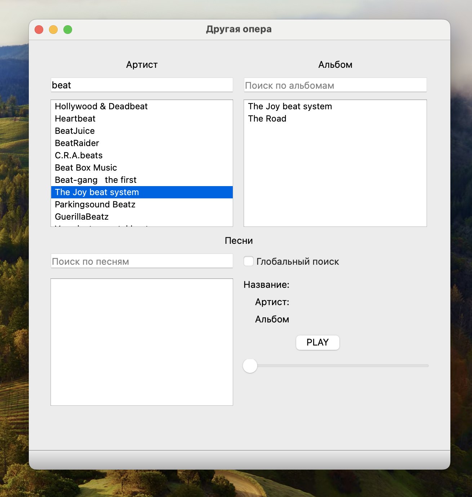
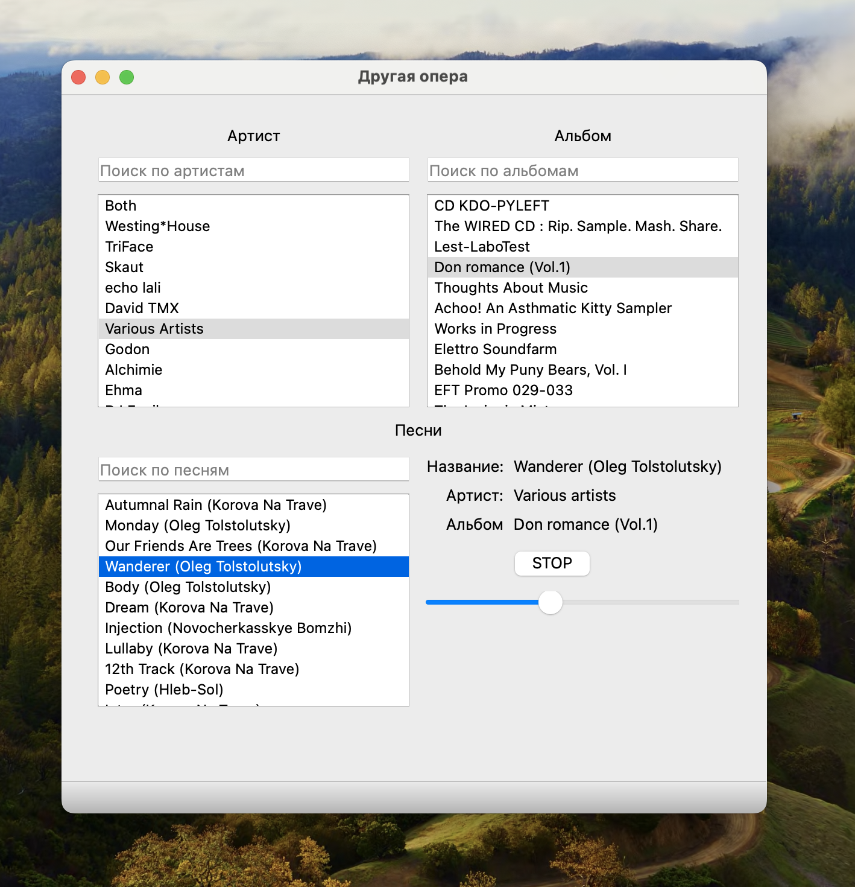
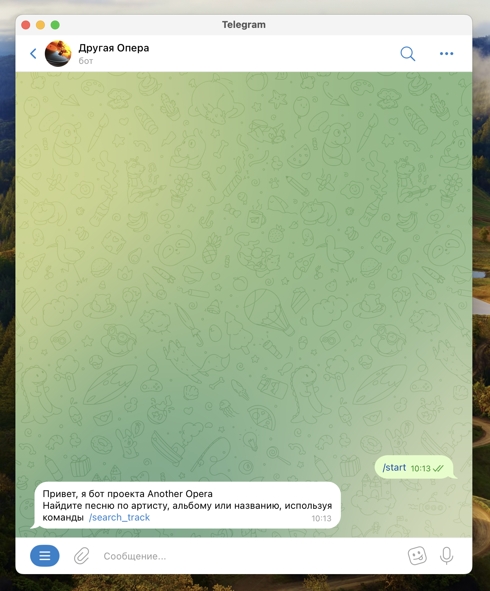
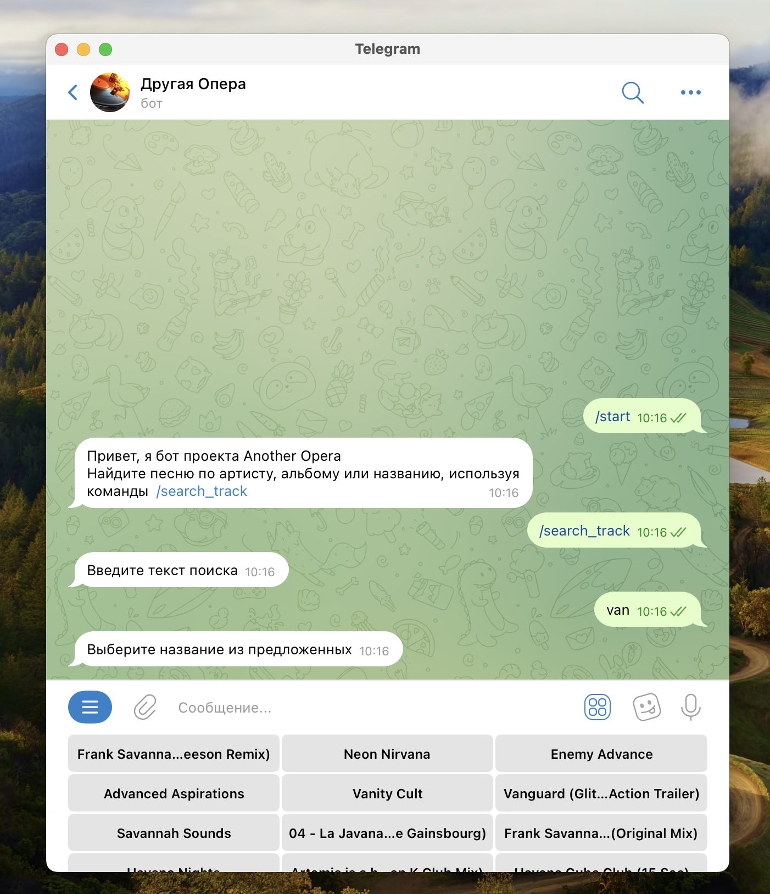
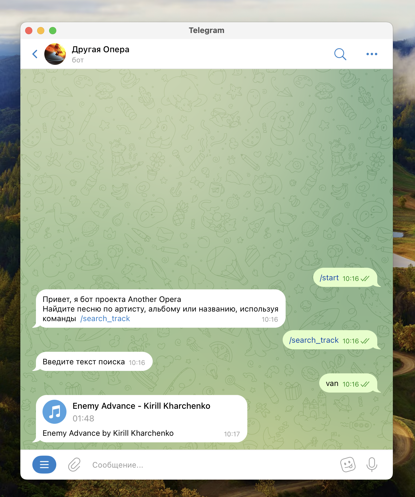

# Проект "Другая опера"

## Описание проекта
Приложение и бот для поиска и прослушивания музыки с сервиса [Jamendo](https://www.jamendo.com/?language=ru).
## Функциональные требования
Приложение с графическим интерфейсом, позволяющее производить поиск и прослушивание музыки. Бот с аналогичным функционалом.
## Технические требования
* Python>=3.10
* Poetry
* PyQt5
* PyTelegramBotApi
## Структура проекта
```
.
├── Makefile
├── QT_windows
│     ├── confirm.ui
│     ├── main.ui
│     ├── new_song.ui
│     ├── select_song.ui
│     └── song_view.ui
├── README.md
├── app
│     ├── __init__.py
│     ├── interface.py
│     └── main.py
├── bot
│     ├── __init__.py
│     ├── main.py
│     └── tg_bot.py
├── config.py
├── poetry.lock
├── pyproject.toml
└── utils
    ├── __init__.py
    ├── api.py
    ├── custom_exc.py
    ├── models.py
    └── special.py

```
## Объяснение структуры проекта
* app - исходный код приложения
* bot - исходный код бота
* utils - исходный код утилит API, логирования, моделей
* QT_windows - файлы UI для приложения

## Инструкция по установке, настройке и запуску проекта
#### Установка:
1. Установите Poetry
2. `make install`
3. `make build`
#### Запуск
`make run`

#### Запуск отдельно бота или приложения
`make bot` или `make app`

#### Проверка чистоты кода
`make lint`

## Пример использования
#### Приложение
Пользуясь строкой поиска, находим артиста, выбираем в соответствующих окнах альбом и песню. Нажимаем `PLAY`. Пока слушаем, можно выбрать следующую песню.
#### Бот
Одной из команд `/search_artist`, `/search_album`, `/search_track` по артисту, альбому или названию находим песню и слушаем в Telegram.
## Скриншоты, подтверждающие работоспособность проекта






## Источники
[Бесплатный музыкальный сервис Jamendo](https://www.jamendo.com/?language=ru)